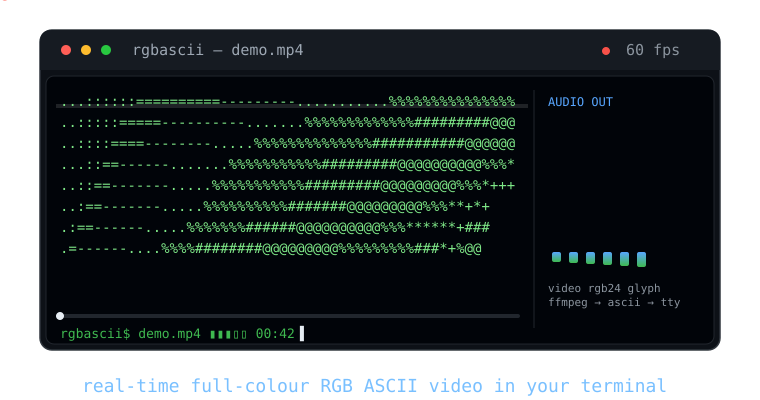

# 

<p align="center">
  
</p>

<p align="center">
  <code>numpy</code> · <code>ffmpeg</code> · <code>sounddevice</code> · Python ≥ 3.11 · MIT
</p>

Play any video as colourful ASCII art right in your terminal — audio included, no GUI.

---

<p align="center"></p>
- **Live & audio-synced** — FFmpeg feeds `sounddevice`; the audio cursor is the master clock.
- **5 render modes** — `ascii`, `rgb`, `grayscale`, `mono`, `halfblock`.
- **Resize-aware** — pauses, seeks and restarts from the keyboard; adapts to terminal resizes.
- **Terminal-safe** — alt-screen, raw input and reset are restored on quit, error, or Ctrl+C.

---

<p align="center"></p>
| Requirement | Install |
|---|---|
| Python 3.11+ | [python.org](https://www.python.org/downloads/) |
| ffmpeg + ffprobe | `brew install ffmpeg` · `apt install ffmpeg` · `choco install ffmpeg` |

```sh
python3 -m venv .venv
source .venv/bin/activate          # or .venv\Scripts\activate on Windows
pip install ".[audio]"
```

Prefer not to activate the venv? Call `.venv/bin/rgbascii` directly.

---

<p align="center"></p>
```sh
rgbascii movie.mp4
```

That's it — full colour, looped, with audio. Press **q** to quit.

---

<p align="center"></p>
Use `--mode <name>`:

| Mode | Look | Best for |
|---|---|---|
| `ascii` (default) | Coloured luminance-mapped glyphs | General use |
| `rgb` | Alias for `ascii` | — |
| `grayscale` | Characters + grey tones only | Monochrome look |
| `mono` | Single colour, no per-pixel colour | Stylised / artistic |
| `halfblock` | `▀` blocks — 2× vertical detail | Smooth, near-pixel video |

---

<p align="center"></p>
All flags at a glance:

| Flag | What it does |
|---|---|
| `--width N` / `--height N` | Render size in columns / rows (auto by default) |
| `--fullscreen` / `--no-fullscreen` | Use alt-screen buffer (on by default) / render in place |
| `--aspect F` | Vertical squeeze factor (default `0.5`) |
| `--mode MODE` | `ascii` \| `rgb` \| `grayscale` \| `mono` \| `halfblock` |
| `--charset STR` | Glyph ramp or preset (`standard` `dense` `minimal` `blocks`) |
| `--invert` | Flip bright↔dark mapping |
| `--sample METHOD` | Cell colour: `average` \| `center` \| `weighted` |
| `--color-levels N` | Posterise to N levels per channel |
| `--mono-color HEX` | Colour for `--mode mono` (default `FFFFFF`) |
| `--color` / `--no-color` | Force ANSI colour on / plain-text output |
| `--brightness F` | Add brightness (−1…1, default 0) |
| `--contrast F` | Multiply contrast (default 1) |
| `--saturation F` | Colour saturation (0 = greyscale, 1 = normal) |
| `--gamma F` | Gamma correction (default 1) |
| `--loop` / `--no-loop` | Loop forever (default) / play once then exit |
| `--start S` / `--end E` | Play seconds S–E |
| `--fps N` | Target frame rate |
| `--no-audio` | Disable audio (video clock only) |
| `--clock MODE` | Clock: `auto` \| `audio` \| `video` |
| `--buffer-ms MS` | Decode-ahead queue (default `120`) |
| `--catchup-ms MS` | Lag before re-seek (default `350`) |
| `--frames N` | Render N frames then exit |
| `--debug` | Print FPS and drop stats |
| `--version` | Print version |

```sh
rgbascii movie.mp4 --width 120 --mode halfblock
rgbascii movie.mp4 --mode grayscale --charset dense
rgbascii movie.mp4 --mono-color FF00CC --start 60 --end 120
rgbascii movie.mp4 --no-audio --fps 15 --debug
```

---

<p align="center"></p>
Press once while playing — no Enter needed:

| Key | Action |
|---|---|
| `Space` / `p` | Pause / resume |
| `q` | Quit |
| `←` / `→` | Seek back / forward 5 s |
| `+` / `-` | Finer / coarser grid |
| `r` | Restart |

<p align="center"></p>
- **No audio** — install with `".[audio]"`, check `ffmpeg` is on PATH, or try `--no-audio`.
- **Garbled colours** — terminal may lack TrueColor: use `--no-color` or `--mode mono`.
- **Slow / dropped frames** — lower `--width`, or raise `--catchup-ms 500`.
- **Wrong size** — force it: `rgbascii movie.mp4 --width 80 --height 24`.

Exit codes: `0` ended or quit, `1` runtime error, `2` usage error, `130` Ctrl+C.

---

<p align="center"></p>
```sh
pip install -e ".[dev]"
pytest                    # all 140 tests
python benchmarks/bench_render.py
```

---

<p align="center"></p>
MIT — see [`LICENSE`](LICENSE).
